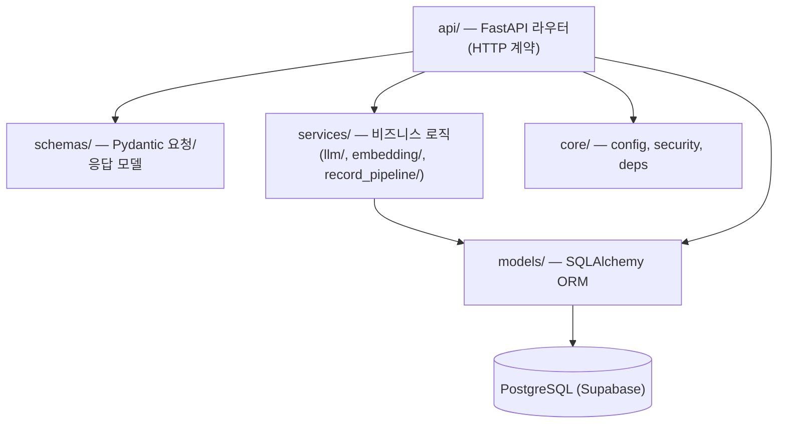
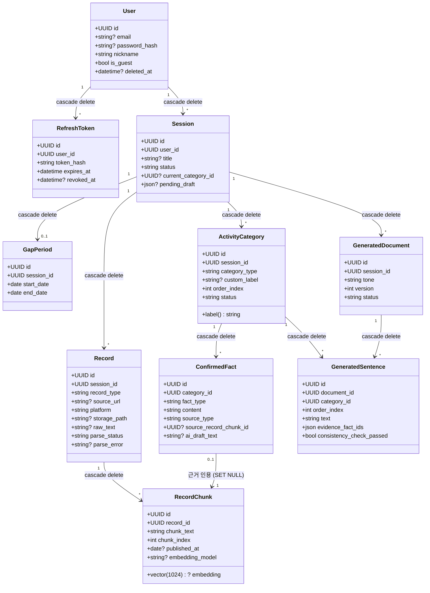
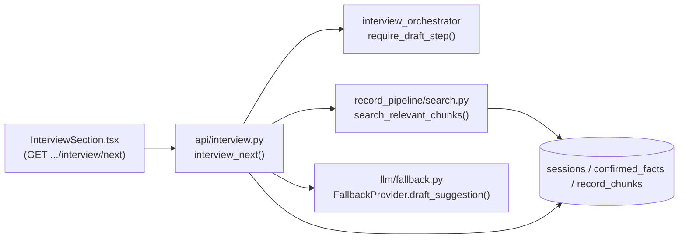

# 아키텍처 문서

이 문서는 백엔드/프론트엔드 코드 구조를 파일·함수 단위로 정리한다. 명세는 [docs/specs/annswieoteum_detailed_spec.md](specs/annswieoteum_detailed_spec.md), 마일스톤 진행 상황은 [docs/checklists/](checklists/), 작업 기록은 [docs/devlog/](devlog/)를 참고. 이 문서는 "지금 구조가 어떻게 생겼고 새 코드를 어디에 둬야 하는가"에 집중한다.

## 1. 개요

- **프론트엔드**: Next.js 14+ (TypeScript, App Router) — `frontend/`
- **백엔드**: FastAPI (Python 3.11+) — `backend/`
- **DB**: PostgreSQL + pgvector (Supabase)
- **LLM**: 로컬 Ollama(우선) → Gemini API(폴백), `LLM_PROVIDER_ORDER` 환경변수로 순서 제어
- **핵심 제약(정직성 가드레일)**: 생성된 모든 문장은 `confirmed_facts` 테이블의 행을 최소 1개 이상 인용해야 한다. 이 제약은 특정 함수 하나가 아니라 여러 계층에 걸쳐 강제된다 — 자세한 내용은 6절.

백엔드는 `api/ → schemas/ + services/ → models/ → db` 방향으로 의존한다:

라우터는 스키마로 입출력을, 서비스로 로직을, models로 영속성을 위임한다. 서비스가 라우터를 import하는 방향은 없다(있었다면 그게 2-1/2-2에서 고친 문제였다 — 7절 참고).

## 2. DB 모델 클래스 다이어그램

모든 상태값(`status`, `record_type`, `source_type` 등)은 `CheckConstraint`로 DB 레벨에서도 강제된다 — 각 모델 파일 상단의 튜플 상수(`SESSION_STATUSES`, `CATEGORY_TYPES`, `FACT_TYPES`, `SOURCE_TYPES` 등)가 그 값 목록의 단일 출처다.

## 3. 백엔드 파일별 상세

### `api/` — 라우터. 전부 `Depends(get_owned_session)`으로 소유권 검증(`core/deps.py`)을 공유한다.

| 파일 | 책임 | 주요 엔드포인트 |
|---|---|---|
| `auth.py` | 회원가입/로그인/게스트/토큰 재발급/로그아웃 | `POST /register`, `/login`, `/guest`, `/refresh`, `/logout`, `GET /me` |
| `sessions.py` | 세션 CRUD (생성/목록/상세/이름변경/삭제) | `POST /sessions`, `GET /sessions`, `GET /sessions/{id}`, `PATCH /sessions/{id}`, `DELETE /sessions/{id}` |
| `interview.py` | 상태머신 진행: 기간→카테고리→기록물스킵→인터뷰(초안/확인) | `POST .../period`, `.../period/extract`, `.../categories`, `.../categories/extract`, `.../records/skip`, `GET .../interview/next`, `POST .../interview/confirm` |
| `records.py` | 기록물(블로그 URL/텍스트/이미지) 업로드·조회·삭제, 백그라운드 파싱 트리거 | `POST .../records`, `.../records/text`, `.../records/upload`, `GET/.DELETE .../records/{id}` |
| `document.py` | 문서 생성/재생성/문장 수정·재생성/확정/내보내기 | `POST .../generate`, `GET .../document`, `POST .../document/regenerate`, `PATCH .../document/sentences/{id}`, `POST .../document/sentences/{id}/regenerate`, `.../document/finalize`, `GET .../export` |

### `schemas/` — Pydantic 요청/응답 모델. `api/X.py` ↔ `schemas/X.py` 1:1 대응.

| 파일 | 대응 라우터 | 주요 클래스 |
|---|---|---|
| `user.py` | `auth.py` | `UserCreate`, `LoginRequest`, `UserRead`, `TokenPair`, `RegisterResponse` |
| `session.py` | `sessions.py` | `SessionCreate`, `SessionRead`(`title` 포함), `SessionRename`, `SessionContextRead`, `ActivityCategoryRead`, `ConfirmedFactRead`, `RecordChunkExcerptRead` |
| `interview.py` | `interview.py` | `GapPeriodSet/Read`, `PeriodExtractRequest/Read`, `CategoryInput`, `CategorySelect`, `CategoryExtractRequest/Read`, `StatusRead`, `RecordsSkipRead`, `BasedOnRead`, `InterviewNextRead`, `InterviewConfirm`, `InterviewConfirmRead` |
| `record.py` | `records.py` | `BlogRecordCreate`, `TextRecordCreate`, `RecordRead` |
| `document.py` | `document.py` | `GenerateRequest`, `CitationRead`, `EvidenceRead`, `SentenceRead`, `SentenceUpdate`, `DocumentRead` |

### `models/` — SQLAlchemy ORM (2절 다이어그램 참고)

| 파일 | 테이블 | 비고 |
|---|---|---|
| `user.py` | `users` | `is_guest`, `deleted_at`(소프트 삭제) |
| `refresh_token.py` | `refresh_tokens` | `token_hash`만 저장(SHA-256), raw 토큰은 저장 안 함 |
| `session.py` | `sessions` | `SESSION_STATUSES` 8-2절 상태머신표, `pending_draft`(JSON, 임시 초안 캐시) |
| `gap_period.py` | `gap_periods` | 세션당 1개(unique FK) |
| `activity_category.py` | `activity_categories` | `CATEGORY_TYPES`, `CATEGORY_STATUSES`, `label` property(`custom_label or category_type`) |
| `confirmed_fact.py` | `confirmed_facts` | **정직성 가드레일 핵심 테이블** — `SOURCE_TYPES`가 `user_confirmed`/`user_edited`/`record_cited`로 제한됨 |
| `record.py` | `records` | `RECORD_TYPES`, `PLATFORMS`, `PARSE_STATUSES` |
| `record_chunk.py` | `record_chunks` | `embedding: Vector(1024)` (pgvector, bge-m3 차원) |
| `generated_document.py` | `generated_documents` | `TONES`, `DOC_STATUSES` |
| `generated_sentence.py` | `generated_sentences` | `evidence_fact_ids`(JSON 배열), `consistency_check_passed` |

### `services/` — 비즈니스 로직

| 파일 | 책임 | 핵심 함수/클래스 |
|---|---|---|
| `interview_orchestrator.py` | 상태머신 전이 규칙(순수 함수, DB 접근 없음) | `require_simple_transition`, `require_status`, `require_draft_step`, `require_confirm_step`, `resolve_after_achievement_confirm`, `next_category` |
| `document_generator.py` | 카테고리별 LLM 호출 → 문장 생성 → 일관성 검사 → 저장 | `generate_full_document()`, `regenerate_sentence()` |
| `consistency_check.py` | 생성 문장과 인용 근거 간 코사인 유사도로 사후 검증(정직성 가드레일 마지막 방어선) | `check_sentence_consistency()`, `max_cosine_similarity()` |
| `storage.py` | Supabase Storage(비공개 버킷) 래퍼 | `SupabaseStorage`(upload/download/delete/create_signed_url), `get_storage()` |
| `llm/base.py` | LLM 프로바이더 계약 + 샘플링 모드 상수 | `LLMProvider`(Protocol), `InterviewContext`, `Suggestion`, `DraftDocument` 등 dataclass, `TEMPERATURE_DETERMINISTIC`/`TEMPERATURE_CREATIVE` |
| `llm/local_ollama.py` | 로컬 Ollama 어댑터 | `LocalOllamaProvider`, `_NUM_CTX` |
| `llm/gemini_provider.py` | Gemini 폴백 어댑터 | `GeminiProvider` |
| `llm/fallback.py` | 순서대로 시도, 실패 시 다음으로 폴백 | `FallbackProvider`, `get_llm_provider()`(DI 훅) |
| `embedding/base.py` | 임베딩 프로바이더 계약 | `EmbeddingProvider`(Protocol) |
| `embedding/local_ollama_embedding.py`, `gemini_embedding.py` | bge-m3 / Gemini 임베딩 어댑터 | `LocalOllamaEmbedding`, `GeminiEmbedding` |
| `embedding/fallback.py`, `__init__.py` | 임베딩 폴백 + DI 훅 | `FallbackEmbedding`, `get_embedding_provider()` |
| `record_pipeline/pipeline.py` | 기록물 파싱→청킹→임베딩 파이프라인(백그라운드 태스크) | `process_record()`, `process_image_record()` |
| `record_pipeline/parsers/{naver_blog,tistory,generic}.py` | 플랫폼별 본문 추출 | 각 `parse(url)` |
| `record_pipeline/platform_detector.py` | URL로 플랫폼 판별 | `detect_platform()` |
| `record_pipeline/chunker.py` | 텍스트 청크 분할 | `chunk_text()` |
| `record_pipeline/ocr.py` | 이미지 OCR | `extract_text_from_image()` |
| `record_pipeline/citation.py` | 근거 인용 정보(출처 URL/발행일) 조회 | `resolve_fact_citation()`, `get_fact_citation()`(DI 훅) |
| `record_pipeline/search.py` | 카테고리 라벨로 의미 검색 | `search_relevant_chunks()`, `get_chunk_search()`(DI 훅) |
| `job_pipeline/job_info_client.py` | 워크넷/고용24 6개 카테고리 조회 + 조건별 호출 분할·병합 | `JobInfoClient.search()`, `search_training_courses()`, `WorknetApiError`, `get_job_info_client()`(DI 훅) |
| `job_pipeline/regions.py` | 지역명 → 워크넷 지역 코드(실호출로 검증한 표) | `RegionFilter`, `resolve_region_filters()`, `KNOWN_REGION_NAMES` |

### `core/`

| 파일 | 책임 |
|---|---|
| `config.py` | `pydantic-settings` 기반 `Settings` — `.env`에서 전체 환경변수 로드 |
| `security.py` | 비밀번호 해싱(bcrypt), JWT 발급/검증, refresh 토큰 해싱 |
| `deps.py` | `get_current_user`, `get_current_user_optional`, `get_owned_session` — 모든 라우터가 공유하는 인증/소유권 의존성 |

## 4. 프론트엔드 구조

### 라우트 (`app/`)

| 경로 | 역할 |
|---|---|
| `app/page.tsx` | 랜딩 — 로그인/게스트 시작 |
| `app/login/page.tsx`, `app/register/page.tsx` | 인증 폼 |
| `app/sessions/layout.tsx` | 세션 사이드바(목록, 이름변경, 삭제) — 모든 `/sessions/*` 하위에 적용 |
| `app/sessions/[id]/page.tsx` | 세션 진행 화면 전체(기간→카테고리→기록물→인터뷰→결과가 한 화면에 채팅형으로 쌓임) |

### 컴포넌트 (`components/`, 13개, 평평한 구조 — 각자 책임이 이름에서 바로 드러나 하위 폴더 분리 근거가 아직 없음)

| 파일 | 책임 |
|---|---|
| `AuthHeader.tsx` | 상단 고정 로그인 상태 표시 |
| `ChatBubble.tsx` | 좌/우 말풍선 공용 프리미티브(라이트/다크 대응 CSS 변수 사용) |
| `ChatComposer.tsx` | 화면 유일의 입력창(순수 입력 캡처, API 호출 없음) |
| `LoadingNotice.tsx` | 로딩 4초 초과 시 콜드스타트 안내 문구 추가 |
| `PeriodSection.tsx` | 공백기 기간 자유 텍스트 입력→AI 파싱→확인 |
| `CategorySection.tsx` | 활동 자유 텍스트→AI 카테고리 추출→확인 |
| `RecordsSection.tsx` | 텍스트/블로그 URL/이미지 기록물 등록 |
| `RecordStatusRow.tsx` | 기록물 파싱 상태 폴링 표시 |
| `InterviewSection.tsx` | 인터뷰 draft/confirm 상태머신과 API 연동 |
| `InterviewChatThread.tsx` | 카테고리별 확인된 사실 + 진행 중 초안 렌더링, 근거 배지 표시 |
| `ResultSection.tsx` | 문서 생성/톤 변경/문장 수정·재생성/확정/내보내기 |
| `EvidenceTag.tsx` | 문장별 근거 태그(클릭 시 출처 상세) |
| `ToneSlider.tsx` | 담백/일반/적극 톤 선택 |

### `lib/`

| 파일 | 책임 |
|---|---|
| `api-client.ts` | **배럴** — `api/` 하위 5개 모듈을 `export *`로 재노출. 기존 `import { sessionApi } from "@/lib/api-client"` 호출부는 그대로 동작 |
| `api/client.ts` | 전송 계층 — `ApiError`, `request`/`requestText`/`requestForm`, 401→refresh→재시도(`withAuthRetry`) |
| `api/auth.ts` | `authApi` + 인증 타입 |
| `api/sessions.ts` | `sessionApi`(세션/기간/카테고리/인터뷰) + 관련 타입 |
| `api/records.ts` | `recordsApi` + 타입 |
| `api/document.ts` | `documentApi` + 타입 |
| `auth-context.tsx` | `AuthProvider`/`useAuth` — 액세스 토큰은 메모리에만 보관, 새로고침 시 refresh 쿠키로 복원 |
| `query-provider.tsx`, `query-keys.ts` | React Query 클라이언트, 쿼리 키 컨벤션 |
| `use-session-context.ts`, `use-sessions-list.ts` | 세션 상세/목록 조회 훅 |
| `session-routes.ts` | 상태→라벨 매핑, 인터뷰/결과 상태 집합 |
| `error-messages.ts` | 백엔드 에러 코드 → 한국어 메시지 매핑 |

## 5. 요청 흐름 예시 (인터뷰 초안 1건)

## 6. 설계 원칙 (다음에 코드 추가할 때 참고)

- **정직성 가드레일**: 생성 문서의 모든 문장은 `confirmed_facts`를 인용해야 한다. 이건 한 함수의 책임이 아니라 세 겹으로 강제된다 — (1) `document_generator.generate_full_document`가 LLM에 ORM 객체가 아니라 `confirmed_facts`의 내용만 넘김, (2) `interview.py`의 `interview_confirm`이 `source_type`을 클라이언트가 지정 못하게 서버가 캐시해둔 `pending_draft`에서만 도출, (3) `consistency_check.check_sentence_consistency`가 생성된 문장과 인용된 근거의 의미적 유사도를 사후 검증. 새 생성 경로를 추가한다면 이 세 겹을 다 거쳐야 한다.
- **DI 훅은 자기 서비스 파일에 둔다**: FastAPI 라우터가 교체 가능한 의존성이 필요하면(테스트에서 가짜로 바꿔치기하기 위해), `get_X()` 함수를 그 X를 구현하는 서비스 모듈 안에 정의한다 — `get_storage()`(`services/storage.py`), `get_chunk_search()`(`services/record_pipeline/search.py`), `get_embedding_provider()`(`services/embedding/__init__.py`), `get_llm_provider()`(`services/llm/fallback.py`)가 전부 이 규칙을 따른다. 라우터 파일에 두면 다른 라우터가 그걸 가져다 쓰려 할 때 라우터끼리 직접 의존하게 된다 (7절 참고).
- **fan-out은 싼 계층에서만 한다**: 워크넷 조회는 순수 HTTP라 동시에 던져도 카테고리당 0.2~1.2초에 끝나지만, 로컬 Ollama는 요청을 직렬 처리하므로 LLM 호출을 동시에 던지면 뒤쪽 호출이 큐에서 자기 타임아웃을 다 쓰고 죽는다(6개 중 5개 실패를 실측, devlog 20). 그래서 조회는 `asyncio.gather`로, LLM 판단은 순차 + 전체 시간 예산으로 돌린다. 새로 LLM 호출을 카테고리/항목마다 추가하려 한다면 먼저 호출 수가 상수인지 확인한다.
- **조건은 사후 필터링이 아니라 조회 질의로 넘긴다**: 워크넷 API는 지역/키워드 필터를 지원하므로, 전국 목록을 받아 LLM에게 걸러내게 하지 않고 질문에서 뽑은 조건을 API에 실어 보낸다. 같은 파라미터에 값을 여러 개 넣는 건 불가능하고(콤마는 0건, 반복 파라미터는 첫 값만 적용), 잘못된 코드도 에러가 아니라 조용한 0건이라 코드 변환은 `regions.py`의 검증된 표만 쓴다.
- **LLM 프로바이더 메서드는 샘플링 모드를 명시한다**: 프로바이더에 새 메서드를 추가하면 `_generate`/`_call`에 `TEMPERATURE_DETERMINISTIC`(분류·추출·판단) 또는 `TEMPERATURE_CREATIVE`(초안·문서 생성) 중 하나를 반드시 넘겨야 한다 — 기본값을 두지 않은 건 그 결정을 강제하려는 의도다. 지정하지 않으면 모델 기본값(~0.7)이 걸려 같은 입력에 회차마다 다른 답이 나온다(devlog 19에서 실측).
- **`api/X.py` ↔ `schemas/X.py` 1:1**: 새 라우터를 추가하면 그 스키마도 같은 이름의 새 파일에 둔다. 기존 파일에 끼워 넣지 않는다.
- **라우터 간 직접 import 금지**: 두 라우터가 같은 헬퍼가 필요하면 그 헬퍼는 `models/`나 `services/`로 옮긴다(모델에 대한 순수 함수라면 그 모델의 property/method로).

## 7. 이번 모듈성 정리에서 옮긴 것

세션 이름변경/삭제 기능을 추가하면서 구조를 점검했고, 아래 4가지를 동작 변화 없이 재배치했다:

1. `get_llm_provider()`: `api/interview.py` → `services/llm/fallback.py` (DI 훅 컨벤션 통일)
2. `category_label()`: `api/sessions.py`의 함수 → `ActivityCategory.label` property (라우터 간 import 제거)
3. `schemas/session.py`(4개 도메인 158줄) → `schemas/session.py` + `schemas/interview.py`로 분리
4. `frontend/lib/api-client.ts`(481줄, 전 도메인 단일 파일) → `lib/api/{client,auth,sessions,records,document}.ts`로 분리, 기존 파일은 배럴로 유지
